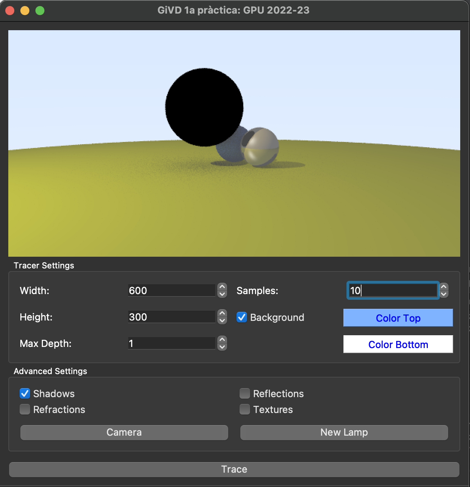
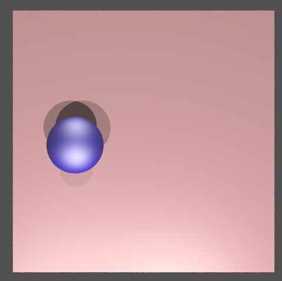

# RayTracingToy
Pràctica 1 - GiVD 2022-23

En aquest fitxer cal que feu l'informe de la pràctica 1.

## Equip:
**F02**
* Pau Baldillou Salse
* Pau Hernando Màrmol
* Esther Ruano Hortoneda
* Núria Torquet Luna

### Features (marqueu les que heu fet i qui les ha fet)
- Fase 0

    S'ha decidit que en aquesta fase inicial tots els integrants del grup realitzin totes les tasques per tal de familiaritzar-se amb la pràctica. Per tant, han participat tots els integrants del grup en la implementació de cada feature
    - [X] Background amb degradat
        - Tots els integrants
    - [X] Color Shading
        - Tots els integrants
    - [X] Normal Shading
        - Tots els integrants
    - [X] Depth Shading
        - Tots els integrants
    - [X] Intersecció amb l'escena
        - Tots els integrants
- Fase 1
    - Creació de nous objectes i interseccions (VIRTUALWORLD) 
        - [X] Hit Box
          - Pau Hernando
        - [X] Hit Triangle
          - Pau Baldillou
        - [X] Hit Malla
          - Pau Baldillou
          - Pau Hernando
    - Creació de REAL DATA
        - [X] FITTED PLANE: Pla de terra
          - Núria Torquet
        - [X] Transformacions Translació i Escalat amb gizmos esferes
          - Esther Ruano
          - Núria Torquet
        - [X] Gizmo de Box
          - Esther Ruano
        - [X] Noves dades
          - Esther Ruano
- Fase 2
    - Pas 1
        - [X] Afegir numSamples i Gamma correction
            - Pau Hernando
    - Pas 2
        - [X] Implementar Blinn-Phong Shading
            - Núria Torquet
        - [X] Implementar Phong Shading
            - Esther Ruano
        - [X] Implementar Cel Shading
            - Pau Baldillou
    - Pas 3
        - [X] Implementar Blinn-Phong Shadow
            - Núria Torquet
        - [X] Implementar Phong Shadow
            - Esther Ruano
        - [X] Implementar Cel Shadow
            - Pau Baldillou
        - [X] Implementar Color, Normal i Depth Shadow
            - Pau Hernando
    - Pas 4
        - [X] Recursió per rajos secundaris
            - Núria Torquet
        - [X] Nou material metàl·lic
            - Pau Baldillou
        - [X] Recursió per objectes transparents
            - Núria Torquet
        - [X] Nou material transparent
            - Esther Ruano
    - Pas 5
        - [X] Adapta la visualització per mostrar dades des d'un fitxer
            - Pau Hernando
 - Fase 3
    - Pas 1
        - [X] Afegir nou material textura al pla base
            - Esther Ruano
    - Pas 2
        - [X] Prova amb diferents jocs de dades i mapes
            - Esther Ruano
    - Pas 3
        - [X] Genera diferents jocs de dades i mapes
            - Esther Ruano
    - Pas 4
        - [ ] Genera noves escenes i resultats finals de la pràctica
       
 

- Parts opcionales: 
  - [X] Cilindres
    - Esther Ruano
  - [ ] Escena CSG 
  
  - [X] Més d'una propietat en les dades reals
    - Esther Ruano
  - [X] Mapeig de les dades reals en una esfera
    - Núria Torquet
  - [ ] Afegir nous objectes paramètrics  
  - [X] Llums direccionals i spotlight
    - Pau Baldillou
    
    
### Explicació de la pràctica    
  * **Organització de la pràctica**
    * descriu com us heu organitzat
  
  * **Decisions a destacar**
    * Comenteu les decisions que heu pres 
    * **Cel Shading**. Hem implementat el Cel shading per un nombre arbitrari de tons per cada objecte. Aquests tons es llegeixen del material de l'objecte al JSON de l'escena. Necessites afegir informació al material? Sí, hem creat una classe abstracta "ToonMaterial". Aquesta classe hereta de Material i alhora és la mare de tots els altres materials. En aquesta classe hem afegit l'atribut "gradientColor" que és un vector de colors. Hem hagut d'implementar els mètodes de llegir i escriure a fitxer. Aquestes funcions criden a les respectives funcions de Material, però a més llegeixen o escriuen el vector de tonalitats. 
    A part del Cel shading com a tal, hem implementat també les extensions explicades a classe, on hem incorporat la component especular, i la llum ambient. A més, hem afegit la silueta dels objectes, que surten ressaltats dins l'escena.
    Per admetre un nombre arbitrari d'intervals, per calcular el color en cada punt calculem $t = \lfloor n \cdot x \rfloor$ on x ès el cosinus entre l'angle de llum i la normal, i n el nombre d'intervals. Aleshores t és l'índex de l'interval corresponent. En cas que el cosinus sigui 1, hem decidit posar el color més clar del que disposem.
    * **SceneFactoryData**:  Hem pres una sèrie de decisions respecte les escales i transicions. En primer lloc, hem decidit no omplir del tot el pla: En una vora d'una unitat d'amplada al voltant del fitted plane no hi haurà cap centre. Això evita que objectes es quedin "fent equilibris" a la vora. Per altra banda, per calcular l'escala ho hem fet de dues maneres: en els arxius dadesEuropa.json, dadesBCNZoom.json i dades BCNOneValue.json hem donat valor mínim 0.35 i valor màxim 2.3 als radis de les esferes. Als altres arxius el mínim ha estat 0.125 i el maxim 1.07. Hem considerat aquests dos casos per separat perquè el primer ens proporciona visualitzacions més semblants a les de l'enunciat, mentre que el segon ens permet mostrar més dades ja que els gyzmos queden més petits.
    
    * **Llum direccional**. Hem implementat una nova classe de llum, la direccional. Aquesta no té posició, doncs està situada a l'infinit. A més, la seva atenuació sempre és 1, pel mateix motiu. Té 2 atributs propis: intensitat i direcció.
    * **Llum spotlight**. Hem implementat una nova classe de llum, la spotlight (o focus). Al igual que la point light, aquesta sí que té posició. I similarment a la direccional, també té una direcció, ja que, a diferència de la point light, no il·lumina en totes direccions. Les llums spotlight, només il·luminen en una regió cònica amb vèrtex la posició de la llum i direcció la recta que seria l'eix de revolució. El con es defineix amb l'angle d'il·luminació (que és l'angle entre la direcció de la llum i la vora del con). Per tot això, la nova classe té com a atributs la posició, la direcció, l'angle de tall (a partir del qual considerarem que un punt no està il·luminat) i l'exponent (que controla com concentrada és la llum).
    
    
         
        
        Per tal de controlar des de la llum, quins punts pot il·luminar, hem canviat la funció que retorna l'atenuació. Aquesta serà 0 en els putns que queden fora del con. Pel punts que queden dins del con, és la següent funció: $\cos(\theta)^{\alpha}$ on $\theta$ és l'angle entre la direcció i el vector que uneix el punt que volem il·luminar i la posició de la llum, i $\alpha$ és l'exponent que guarda la llum.
    
### Resposta a les preguntes plantejades
* **Fase 0**: 
    * **3.b. Quina escena es té carregada? Qui la crea? Quin setup té la classe? Des d'on es crea?**
        La classe RayTracer és la responsable de trçar rajos per a renderitzar imatges d'una escena en 3D. La imatge és emmagatzemada en un objecte QImage, que es passa com a paràmetre al constructor de la classe RayTracer. El mètode run() de la classe RayTracer conté el bucle principal del renderitzat, on cada píxel de la imatge es renderitza mitjançant el llançament de rajos. Els objectes necessaris per a la renderització, com ara el setup i l'escena, s'obtenen de la classe Controller, utilitzant mètodes estàtics. Per tant, la classe Controller és responsable de crear i gestionar la configuració de la renderització i l'escena, i es fa servir per la classe RayTracer per obtenir aquestes dades.
    * **3.c. Per què es veu un degradat en l'escena? A quin mètode es calcula aquest color?**
        Si prems el botó de Trace, es veu un degradat perquè el mètode RayPixel() de la classe RayTracer retorna un degradat en cas que l'opció de "background" estigui activada en la configuració del renderitzat.

        En aquest cas, el degradat es calcula a la part superior del mètode RayPixel(), on es normalitza la direcció del raig i s'utilitza per calcular el color de fons. El càlcul es fa mitjançant la creació d'un vector que té les seves components normalitzades i, a continuació, es transforma aquest vector a un color RGB de 24 bits.
    * **3.d. Si desactives el flag de background, i tornes a fer Trace, quin efecte et trobes? Per què? Pots veure com ha arribat el flag de background al teu RayTracer?**
        Si desactives el flag de background i tornes a fer Trace, es veurà una imatge negra sense cap mena de degradat. Això és degut a que el càlcul del color de fons només es fa si el flag de background està activat. En desactivar-lo, el color de fons es posa a negre per defecte.

        El flag de background es pot trobar al mètode init() de la classe RayTracer, on es comprova si aquesta opció està activada en la configuració del renderitzat. Aquesta configuració es carrega en el constructor del RayTracer a través del controlador, que obté la configuració i l'escena corresponents.
    * **3.e. En quina variable trobes els colors per fer el degradat?**
        Es poden obtindre els colors de background superior i inferior fent les següents crides amb la variables setup:
            setup->getTopBackground();
            setup->getDownBackground();
    * **3.f. I si volguessis canviar els colors del degradat? On els canviaries?**
        A la interfície seleccionaria uns altres colors de la paleta, i amb aquests canvis obtindria uns nous valors de retorns en els getters de background de setup.
    * **3.g. Des del menú de File pots crea una esfera unitària amb centre al punt (0, 0, 0). Si prems Trace, no la veuràs, per què?**
        La raó per la qual no es veu la nova esfera és que encara no s'ha implementat la intersecció amb objectes de l'escena en el càlcul de colors per cada píxel. El mètode RayPixel actual només retorna el color del degradat de fons, i no fa cap comprovació per veure si el raig interseca amb algun objecte de l'escena. Per tant, fins que no s'implementi la intersecció amb objectes de l'escena, no es podrà veure cap objecte nou afegit a l'escena.
    * **3.h. Com pots accedir a les diferents estratègies? A quina variable pots aconseguir l’estratègia a cridar? Com es crea aquesta estratègia des del menú?**
        Mitjançant la variable setup, cridant el mètode getShadingStrategy() per obtenir el shading que s'està aplicant. I per aplicar el shading concret a l'escena, amb el mètode shading. Aquest es troba definit de forma virtual a la classe ShadingStrategy i implementat de forma diferent en cada classe shading.
        Per a crear aquesta estratègia des del menú, quan l'usuari clica un dels shadings, en la MainWindow es llença el senyal de que s'executi activaXXShading(), localitzat en Builder. Builder crida a Controller per a que creï una instància del shading XX i estableixi en la variable setup que el shading a aplicar sigui aquest (setShadingStrategy). Aleshores en el mètode rayPixel de RayTracer es comprova des de setup quin shading s'ha d'aplicar i es crida el mètode shading corresponent a la classe.
    * **3.i. Com faràs per a crear una nova estratègia de shading?**
        S'ha de crear una nova classe per a gestionar el shading que heredi de ShadingStrategy. A continuació s'implementa el mètode virtual shading() amb la implementació concreta del shading que es vulgui. S'ha d'afegir aquest nou tipus a l'enum SHADING_TYPES del fitxer ShadingFactory. I s'ha d'inicialitzar correctament amb l'ajuda de l'enum a la classe ShadingFactory.
    * **3.j. Com aconsegueixes que els colors del depth shading estiguin normalitzats?** 
        Es pot dividir la distància entre el punt de vista (lookFrom) i el punt d'intersecció amb l'objecte per un valor de distància màxim predefinit, per evitar la sobreexposició dels píxels llunyans. En el nostre cas, s'ha establert que sigui 10. Si el valor màxim de distància és 10 unitats, qualsevol distància superior a 10 es considerarà el màxim i es normalitzarà per aquest valor.
        Per tant,  es normalitza la distància real (distance) dividint-la pel valor màxim de distància (max_distance). Això produeix un valor entre 0 i 1, que representa la distància normalitzada. Aquesta normalització és important per garantir que la funció de shading es comporti de manera coherent independentment de la distància entre el punt de vista i el punt d'impacte.
    * **3.k. Per què veus només una esfera? On està situada a la teva escena? Amb quin radi? Per què? Per què és lila i no de color "kd": [0.7,0.6,0.5] com posa el fitxer?**
        El fitxer de dades real data0.json defineix una escena amb només una esfera perquè només hi ha un element en la llista "attributes". Aquest element té un nom "temperatura", un gizmo "sphere" i un únic punt de dades en la posició -2,-1 amb un valor de 0.5. Aquest punt es representa com una esfera perquè el gizmo de l'atribut és "sphere".
        L'esfera es troba a la posició (-2, 0, -1) a la nostra escena virtual, ja que el fitxer de configuració especifica que el rang de coordenades en la dimensió Y és de 0 a 2.0. El radi de l'esfera es defineix per defecte a 0.5, ja que no s'especifica cap valor de radi a la configuració de l'atribut.
        La raó per la qual la esfera és lila en lloc de tenir el color especificat per "kd": [0.7, 0.6, 0.5] és perquè el valor de "colorMap" a l'atribut és "COLOR_MAP_TYPE_INFERNO". Això significa que es fa servir un mapa de colors anomenat "inferno" per assignar colors a l'atribut segons el seu valor. El mapa de colors "inferno" és una gradació de colors que comença amb tons de blau i morat, passa a través de vermells i grocs brillants, i acaba amb tons de groc verdós. En aquest cas, el valor de 0.5 es correspon a un to de morat en el mapa de colors "inferno", de manera que l'esfera es veu lila.

* **Fase 1**:
    * **Pas 3**:
        **3.a. Modifica la classe ```ObjectFactory``` per a carregar i crear malles poligonals en fora de ```Mesh```. En aquest cas, el ```read``` de la classe ```Mesh``` ja està implementat. Quan penses que és millor crear els triangles de la malla?**  
            Ho hem implementat de manera que no cal crear els triangles, doncs ho calculem directament amb les cares. Tanmateix, en cas que volguéssim fer servir els triangles, els calcularíem quan fem el ```read```, desprès de llegir les cares. D'aquesta manera, només cal fer-ho una vegada i és quan es carrega l'objecte, i no cada cop que volem fer hit. Si calculessim els triangles quan els necessitem al ```hit```, aleshores el nostre algorisme seria molt lent.
        ** 3.b. Implementa les dues possibilitats, la de la *bounding box* i la de la *bounding sphere*. Quina creus que teòricament és millor? Com funcionen en realitat?**  
            En realitat, tot funcionarà de la forma de l'objecte. Si la nostra malla té una forma esfèrica, la *bounding sphere* serà més similar, fent-la més eficient a l'hora de calcular el hit previ. En canvi, si la malla és allargada (un el·lipsoide per exemple), la caixa serà millor. En la implementació actual, les caixes estan sempre aliniades amb els eixos. Això també podria fer que per una figura cúbica rotada de la manera adequada, la *bounding sphere* fos millor. Tot i així, hem decidit fer tests per veure quina de les dos opcions és més eficient, en quant a temps es refereix. Vam fer els test amb la teapot com a objecte, ja que vam considerar que era el més imparcial possible. Ens van donar uns resultats molt semblants, aixi que vam decidir implementar la bounding bo perquè és molt més senzill d'implementar i per tant es necessiten menys càluls.
            
    * **Pas 5**:
        * **5.c. Com calcularàs el centre del teu objecte en l'escena virtual? Com calcularàs la seva escala?**
            Al fitxer de dades se'ns proporciona els punts mínims i màxims del món real i de l'escena virtual. Al llegir les dades, per cada gyzmo també tenim en quina posició del món real prové la dada geolocalitzada. Per tant, cal calcular el centre com un canvi de coordenades del món real al món virtual. Posem la y = 0 per estar a l'altura del pla. Per fer-ho calculem una traslació adequada:
            ```
            float new_x = mapping->Vxmin + 1 + ((dades[i].second.at(j).x - mapping->Rxmin) / mr_width * (mv_width - 2));
            float new_y = 0.f;
            float new_z = mapping->Vzmin + 1 + ((dades[i].second.at(j).y - mapping->Rzmin) / mr_depth * (mv_depth -2 ));
            ```
            
            (L'1 és per no sortir-nos del pla)
            
            Respecte l'escala de l'objecte, les dades també ens donen el valor (d'allò que estem mesurant) en aquella localització i els valors mínims i màxims que pot tenir. Llavors calculem l'escala de l'objecte amb la següent fórmula:
            ```
                float scale = 1 + 1.85 * ((dades[i].second.at(j).z - mapping->attributeMapping[0]->minValue) / (mapping->attributeMapping[i]->maxValue - mapping->attributeMapping[i]->minValue));
            ```
            (Els valors 1 i 1.85 els hem escollit nosaltres per tal d'obtenir visualitzacions que considerem en una escala correcta)

* **Fase 2**:
    * **Pas 1**:
        * **2. On afegiries un atribut ```numSamples``` que defineixi el nombre de rajos per píxel i així controlar aquest fet?**
        Hem afegit l'atribut numSamples dins de setUp, ja que es modifica directament des del mainUI, de la mateixa forma que les shadow o refractons. D'aquesta manera, mitjançant un onValueChanged(), el controlador agafa la instància de setUp i seteja aquesta variable.

        * **3. Per aclarir la imatge, s'utilitza una correcció del color final calculat. Aquest fet s'anomena *Gamma Correction*. Es tracta de fer l'arrel quadrada de cada canal del color just abans de pintar-lo. On faràs aquesta correcció?**
    Aquesta correció es fa just després de calcular el mean Color de cada pixel, ja que d'aquesta forma només hem de calcular l'arrel quadrada un cop per píxel.
    * **Pas 2**:

        * **3. Implementa *Phong Shading*. Què necessites canviar?**

            En general, la diferència més notable entre la implementació de Blinn-Phong shading i Phong shading és la forma en què es calcula el component especular. Mentre que Blinn-Phong utilitza el vector de vista i el vector de mitjana com a paràmetres per a la funció de distribució especular, Phong shading utilitza el vector de reflexió i el vector de vista.
            Concretament, la fórmula per al component especular en Blinn-Phong shading és:
            ```(info.mat_ptr->Ks * light->getIs() * pow(std::max(dot(N,H), 0.0f), info.mat_ptr->beta)) * depthAttenuation;```
            Mentre que en Phong shading és:
            ```(info.mat_ptr->Ks * light->getIs() * pow(std::max(dot(R,V), 0.0f), info.mat_ptr->shininess)) * depthAttenuation;```
            A més, en Blinn-Phong s'utilitza un paràmetre "beta" per controlar la distribució especular, mentre que en Phong s'utilitza el paràmetre "shininess" per controlar la concentració del brillantor. Ara bé, a la pràctica s'ha utilitzat el mateix valor per als paràmetres "beta" i "shininess".   
            
        * **4. Implementa *Cel Shading*. Necessites afegir informació en el material?**
            Sí. Cal afegir els diferents colors (més foscos i més clars) que volem que tingui cada material. Això ho hem fet creant una classe abstracta ```ToonMaterial``` que conté un vector de colors (vec3) de mida arbitrària (```colorGradient```). Aquests colors, ordenats segons la seva claror, són els que s'utilitzen per pintar les figures, depenent de l'angle d'incidència de la llum. La classe ```ToonMaterial``` hereta de ```Material```. Alhora, tots els altres materials són classes filles de ```ToonMaterial```.
            
    * **Pas 3**:
        * **2. En el cas que hi hagi un objecte entre la llum i el punt on s'està calculant la il·luminació, quina component de la fórmula Blinn-Phong s'haurà de tenir en compte?**
        En el cas que hi hagi un objecte entre la llum i el punt on s'està calculant la il·luminació, la component que s'haurà de tenir en compte és la difusa, ja que és la que es veu afectada per la presència d'ombres.
        
    * **Pas 4**:
        * **3. Tingues en compte que necessitaràs la *nu_t* per a definir el material transparent. Tot i que ara el codi no està llegint aquesta nu_t, on hauries de llegir-la?**
        A la classe Material, al mètode read() s'ha de llegir també el paràmetre nu-t; si el fitxer json conté el paràmetre nut i aquest valor és de tipus double, s'ha d'assignar el valor a la variable nu-t del material.
        
        * **Per què si tens el MAX_DEPTH a 1, l'esfera no es veu transparent?**
        Si tenim el valor MAX_DEPTH a 1, això significa que només es farà un rebot de llum, és a dir, només es seguirà un raig de llum després de xocar amb l'objecte. Per tant, si l'objecte és opac, no es veurà res més enllà d'aquest objecte, ja que només es considera un únic rebot de llum.

        * **Si assignes el color ambient global en lloc del de *background* en els rajos secundaris que no intersequen amb res, com et canvia la visualització? Raona el per què.**
        Si assignem el color ambient global en lloc del color de fons (background) en els rajos secundaris que no intersequen amb cap objecte, la visualització canvia perquè tots els píxels que no estan directament en la línia de visió dels objectes de la nostra escena reben el mateix color ambient, creant una mena d'il·luminació uniforme en la imatge. Això pot ser útil per crear un efecte d'illuminació ambiental a la nostra escena, però també pot provocar que la imatge aparegui una mica "plana" i sense profunditat.

        * **Raona per què en aquests casos l'escena es veu més clara**
        Si no es pondera el color local amb (1- colorScattered) els materials transparents no absorveixen la llum que travessa l'objecte, cosa que significa que la llum passa per ells sense ser atenuada. Això pot fer que les escenes semblin més brillants i clares en general, però també afecta negativament en la percepció de la profunditat i oclusió de la imatge.
        
* **Fase 3**:
    * **Pas 1**:
        * **Amb el fitxer de setup setupDataEuropa.json quina de les dues imatges obtens? Raona per què.**
        Ens trobem en la situació de l'esquerra: és fàcil de veure, si mirem dadesEuropa.json, trobem que el pla correspon a l'equació {y=-1}, i està afitat per valors d'x i z entre -50 i 50. Com que és un fitxer de tipus RealData, per les esferes en coneixem el valor x i z del centre, i li donem valor y = 0 per defecte al centre. A més, en funció de quin escalat triem, l'imatge obtinguda s'assemblarà més a la de l'enunciat; si fem servir la dels gyzmos les esferes no travessaran el plan, en canvi amb l'altre sí. Es pot veure a la secció de captures com, efectivament, som a la de l'esquerra.
        * **Qui calcularà les coordenades (u, v) del punt d’intersecció amb el pla?**
        Les calcularà la classe fitted plane i les desarà a l'atribut uv de la classe HitInfo, perquè hi pugui accedir el shading corresponent.
        * **Quina de les dues visualitzacions obtens?**
        Obtenim la segona visualització, que correspon a la imatge de sota a l'enunciat. A la secció de captures es troba la imatge amb l'escala gran, ja que dona una visualització més semblant a la de l'enunciat.
     * **Pas 2**:
        Captures dispobibles a la secció de captures.
        * **Prova també a posar les esferes metàl·liques i transparents, com feies a la Fase 2.**
        Hem afegit quatre esferes transparents a DadesEuropa.json, i n'adjuntem les visualitzacions a la secció de captures.
     * **Pas 3**:
        * **Cal incloure com a mínim un nou joc de dades amb un mínim d’una propietat, amb un mínim de 15 dades i amb algun altre mapa**
        Hem creat un arxiu anomenat dadesDeltaTextured.json i un setupDataDelta.json. Modelen la població d'ànec xiulador (esferes transparents), així com l'ànec blanc (box metal·lics), l'ànec griset (cilindres lambertians) al Delta de l'Ebre. Hem inclòs el mapa a la carpeta de "resources". 
     * **Pas 4**:
        * **Genera noves escenes i resultats finals de la pràctica**
        Les generarem durant la pròxima setmana i les penjarem al padlet de l'assignatura.
    
### Screenshots de cada fase
* **Fase 0**:
   - Intersecció dels rajos amb una esfera
    
    
    
    
    
    

    - Intersecció dels rajos amb dues esferes
    
    
    
    


* **Fase 1**: 
    * **Pas 1**: Box 
    
    
    
    Normal shading per mostrar bé les cares de la caixa.
    
    * **Pas 2**: Triangle

    
    
    * **Pas 3**: Mesh

    
    
    Tetera del campus amb Normal Shading i ombres.

    * **Pas 3b. Tests per trobar què és mes eficaç: Boundong Box o Sphere?**
        - Codi utilitzat per a fer els tests:
        
        

        
        - Resultat per a la bounding Box:

         


        - Resultat per a la bounding Sphere:

         

         
    * **Pas 5. Creació de l'escena a partir de dades geolocalitzades**
    
        b. Visualització del pla afitat amb el fitxer fittedPlane.json
    
        

        
        c. Visualització dels "gizmos" tipus Sphere del fitxer data0.json
        
        

        
        d. Visualització dels "gizmos" tipus Box del fitxer data_box0.json
        
        

        
        e. Proves amb el fitxer data10.json
        
        

        
        f. Modificació del fitxer data0.json per a afegir esfera i box com a gizmos. El fitxer resultant s'ha anomenat data0 _box_sphere.json
        
        

    

* **Fase 2**:
    * **Pas 1. Aliasing i Gamma Correction:**
        a. Apliquem anti aliasing fent la mitja per cada pixel
        
        b. Fem una correcció per tal d'aclarir la imatge

        - Resultat abans:          

        


        - Resultat després:

        

    
    * **Pas 2. Considera les llums puntuals a la teva escena i implementa el shading de Blinn-Phong:**
        - Blinn Phong Shading usant el fitxer twoSpheres.json i el fitxer de setup setupRenderTwoSpheres.json

            a. Si només es calcula la component ambient
            
            

            
            b. Si només es calcula la component difosa
            
            

            
            c. Si només es calcula l'especular
            
            

            
            d. Ara les tres juntes
            
            

            
            e. I afegint atenuació amb profunditat
            
            

            
            f. I afegint l'ambient global
            
            


        - Phong Shading usant el fitxer twoSpheres.json i el fitxer de setup setupRenderTwoSpheres.json
            a. Si només es calcula la component ambient
            
            

            
            b. Si només es calcula la component difosa
            
            

            
            c. Si només es calcula l'especular
            
            

            
            d. Ara les tres juntes
            
            

            
            e. I afegint atenuació amb profunditat
            
            

            
            f. Phong Shading no té llum ambient global, només té component ambient local


        - Cel Shading i les seves ombres (Pas 3)

             

            Component ambient amb nSamples = 1

            

            Component "Toon": només els colors de les tonalitats. Això correspon a com es veu sense extensions.

             

            Component especular amb shininess = 100 (es veu una taca blanca molt petita)

            

            Rim (la silueta)

            

            Tot junt sense ombra amb nSamples baix.

            

            Tot junt sense ombra amb més samples.

             

            Tot junt amb ombra.

             

            La mateixa imatge amb una bola vermella, ombra i 10 samples.

             

            La mateixa imatge amb una bola vermella i més samples.
    
    * **Pas 3. Afegeix ombres**

        - Blinn Phong Shadow des de dos punts de vista
        
            
            
            
        - Phong Shadow des de dos punts de vista
        
            
            
            
        - Normal Shadow
        
            
            
        - Visualització del fitxer spheres.json amb el setup setupRenderSpheres.json
        
            
            
            
        - Escena més complexa modificant el fitxer spheres.json (reanomenat spheres_10.json) amb 10 objectes i Blinn-Phong Shading
        
            
            
            
    * **Pas 4: Afegir recursió al mètode RayPixel per a tindre en compte els rajos reflectits**
        
        - Resultats obtinguts amb dues esferes amb material Lambertià, valors de Max Depth 1, 3 i 10 i nombre de samples 10. Shading Blinn-Phong, fitxer de setup setupRenderTwoSpheres.json i fitxer de dades twoSpheres.json
        
        
        
        
        
        - Resultats obtinguts al assignar la intensitat ambient global als rajos secundaris que no intersequen amb l'escena.
    
        
        
    
    
        - Resultats obtinguts al visualitzar dues esferes lambertianes i una de metàl.lica, amb valors de Max Depth 1, 3 i 10 i nombre de samples 10. Shading Blinn-Phong, fitxer de setup setupRenderSpheres.json i fitxer de dades threeSpheres.json
    
        
        
        

        - Visualitzacions dels shadings Phong, Cel i Normal amb mateix setup file i fitxer de dades.
            - Phong Shading:
            
                
                
                

            - Normal Shading:
            
                
                
                
            
            - Cel Shading:

                
                
                
    
    * **Pas 5: Afegir recursió al mètode RayPixel per a tindre en compte objectes transparents**
        
        - Resultats obtinguts al visualitzar el fitxer spheresMetalTransp.json i el setupRenderTwoSpheres.json. Max depth pren els valors 1, 2 i 3, i el nombre de samples és 10.
        
            
            
            
    
        - Modificant el punt de vista amb valors de lookFrom (-5, 0, 1) i lookAt (-2, 0, 0) i canviat el valor de kd a [0.7, 0.7, 0.7]
    
            
        
        - Visualitzacions amb el fitxer fourSpheres.json i el setupRenderFourSpheres.json i nivells de recursivitat MAXDEPTH = 1, 2, i 4. Nombre de samples és 10.
        
            
            
            
            
        - Visualització de l'escena anterior fent que els rajos secundaris que no intersequen amb l'escena rebin el color ambient global.
        
            
    
        - Visualització de l'escena anterior fent que no es ponderi el color local.
    
            
            
            
    * **Pas 6: Visualization mapping**
    
        - Renderitzar el fitxer data0.json carregant el fitxer seripRenderData0,json com a setUp:
        
        
        
        - Data file: dadesBCNOneValue.json , Load file: setupDataBCNOneValue.json
        
        
        
        
        - Data file: dadesBCNZoom.json , Load file: setupDataBCN_Zoom.json
        
        
        
        - Data file: dadesBCN.json , Load file: setupDataBCN.json, Fitted plane: Y = 0
        
        
        
        - Data file: dadesBCN.json , Load file: setupDataBCN.json, Fitted plane: Y = -1
        
        
        
        - El mateix món virtual, però vist des del costat
        
        
        
        - Data file: dadesBCNMetal.json , Load file: setupDataBCNMetal.json
        
        
        
        - Data file: dadesBCNTransparent.json , Load file: setupRenderData0.json, Max depth: 3
        
        
        
        - Data file: dadesBCNTransparent.json , Load file: setupDataBCNTransparent.json
        
        
        
        - Data file: dadesBCNTransparent.json , Load file: setupDataBCNTransparent.json, vup: (-1,0,0)
        
        
        
        - Data file: dadesBCNTransparent.json , Load file: setupDataBCNTransparent.json, vup: (1,1,0)
        
        
        
        - Data file: dadesBCNTransparent.json , Load file: setupDataBCNTransparent.json, vfov: 20
        
        
        
        - Data file: dadesBCNTransparent.json , Load file: setupDataBCNTransparent.json, vfov: 10
        
        
        

* **Fase 3**:
    * **Pas 1: Afegeix un nou material de textura al pla base**
    
        - Carregar dadesEuropa.json amb setupDataEuropa.json

        
        
        - Carregar dadesEuropaTextured.json amb setupDataEuropa.json
        
        
    
    * **Pas 2: Prova amb diferents jocs de dades i mapes**
        - Carregar dadesBCNOneValueTexture.json amb setupDataBCN.json
        
        
        
        - Carregar dadesBCNOneValueTexture.json amb setupDataBCN_Zoom.json
        
        
        
        - Carregar dadesBCNTexture.json amb setupDataBCN.json
        
        
        
        - Esferes d'altres tipus: dadesEuropaCustom.json amb setupDataEuropa.json
        
        
  
    * **Pas 3: Prova amb diferents jocs de dades i mapes**
        - Nou joc de dades: dadesDeltaTextured.json amb setupDataDelta.json
        
        

    


* **Opcionals**:
    - Directional Light
    
    ") 
    
    ")

    El groc clar que es veu "independentment d'on ve la llum" és el rim de la bola gran.
    
    - SpotLight

    
    
    Imatge que mostra una spotlight amg els atributs: 
      "direction": [-1.0, -1.0, 0.0],
      "position": [1.0, 3.0, 0.0],
      "cosineCutoff": 0.97,
      "exponent": 1.5

    - Cilindre

    
    
    - Cilindre com a gyzmo
        Obrint l'arxiu test_plane_spheres_cylinder_box.json com a dataFile trobem una sèrie de gyzmos de cada mena, tots lambertians, i les interseccions entre ells. La següent visualització s'obté amb el setup setupDataEuropa.json i la càmera a (0,3,3):
        
    

* **Més visualitzacions**:

   * Per totes les imatges, incluiu aqui la imatge obtinguda i els fitxers de dades i de configuració que heu fet servir
